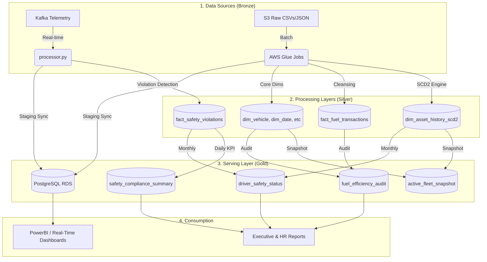

# 🌌 OmniRoute: Enterprise Logistics Data Platform

**OmniRoute** is a highly fault-tolerant, production-grade logistics analytics platform. It processes massive telemetry streams alongside batch organizational data through a multi-layered Medallion Architecture (Bronze, Silver, Gold) to deliver real-time driver safety monitoring, automated fuel efficiency audits, and immutable fleet history tracking.

---

## 🏗️ System Architecture

---

## 📂 Medallion Data Architecture

OmniRoute strictly adheres to the Medallion architecture, ensuring data quality increases as it moves through the pipeline. All tables from Silver onwards are stored in **Delta Lake** format on Amazon S3.

### 🥉 Bronze Layer (Raw & Processed Data)
The ingestion zone for immutable, raw data assets. Processed data passes a "Data Firewall" to strip whitespace and enforce strict schema types.
*   **`vehicle_registry.csv`**: Master list of vehicles.
*   **`restricted_zones.json`**: Geofence coordinate boundaries.
*   **`vehicle_assignment*.csv`**: Incremental driver-to-vehicle assignments.
*   **`fuel_transactions.csv`**: Raw fuel receipts and volumes.
*   **`maintenance_schedules.csv`**: Annual fleet maintenance records.
*   **`kafka_telemetry`**: 1-second JSON telemetry stream (Speed, GPS, VIN, Driver ID).

### 🥈 Silver Layer (Cleaned, Enriched, Conformed)
The enterprise truth layer. Data is deduplicated, structured, and joined with core dimensions.
*   **`dim_vehicle`**: Conformed vehicle metadata (model, make, fuel capacity).
*   **`dim_date`**: Master date dimension for robust chronological joins.
*   **`dim_restricted_zones`**: Flattened, queryable geofence definitions.
*   **`dim_asset_history_scd2`**: The heartbeat of the fleet. Implements Slowly Changing Dimensions (Type 2) to track exactly which driver was in which vehicle down to the second.
*   **`dim_maintenance_schedule`**: Validated maintenance windows.
*   **`fact_fuel_transactions`**: Deterministically deduplicated fuel receipts.
*   **`fact_safety_violations`**: Streaming event logs for Speeding and Geofence violations.

### 🥇 Gold Layer (Business-Level Aggregations)
Highly refined datasets built specifically for BI dashboards, reporting, and business logic enforcement.
*   **`active_fleet_snapshot`**: Daily point-in-time state of the entire "IN-TRANSIT" fleet.
*   **`fuel_efficiency_audit`**: Cross-dimensional aggregations calculating KMPL (Kilometers Per Liter) and identifying fuel fraud.
*   **`safety_compliance_summary`**: Daily KPIs including total violations and Top 10 worst offenders.
*   **`driver_safety_status`**: Monthly tracking of driver suspension states, strikes, and rate deductions.
*   **`driver_rate_deduction_report.txt`**: Generated physical reports for HR payload exports.

---

## 🛠️ The Batch Pipeline (AWS Glue)

Orchestrated via Apache Airflow, the batch pipeline consists of 8 highly modular AWS Glue PySpark jobs.

| Job | Name | Layer Focus | Core Purpose |
| :--- | :--- | :--- | :--- |
| **Job 1** | `dim_core_load` | 🥉 → 🥈 | Ingests vehicle registry and restricted zones (JSON/CSV) into Delta format. |
| **Job 2** | `asset_scd2_engine` | 🥉 → 🥈 | Complex SCD2 engine utilizing Window functions to manage incremental driver assignments. |
| **Job 3** | `fuel_enrichment` | 🥉 → 🥈 | Cleanses and deterministically deduplicates raw fuel logs. |
| **Job 4** | `gold_fuel_audit` | 🥈 → 🥇 | Massive multi-table joins and historical Window `LAG` functions to calculate distance and KMPL. |
| **Job 5** | `gold_fleet_snapshot` | 🥈 → 🥇 | Filters SCD2 for active assets to generate management overviews. |
| **Job 6** | `gold_safety_summary` | 🥈 → 🥇 | Aggregates daily streaming violations into executive compliance KPIs. |
| **Job 7** | `yearly_maintenance` | 🥉 → 🥈 | **Yearly DAG**: Loads predictive maintenance logs, partitioned strictly by execution year. |
| **Job 8** | `monthly_cooldown` | 🥈 → 🥇 | **Monthly DAG**: Generates HR deduction reports and implements immutable driver rollover logic. |

---

## 🌬️ Advanced Airflow Orchestration

OmniRoute features an enterprise-grade Airflow orchestration layer designed to never fail silently.

1.  **Cross-DAG Dependencies**: `DAG 2` (Fuel/Safety) utilizes `ExternalTaskSensor` to wait up to 90 minutes for `DAG 1` (Dims) to successfully build daily dimensions before executing.
2.  **Graceful Degradation & Fallbacks**: If upstream S3 files fail to arrive, `BranchPythonOperator` checks S3 for historical snapshots. If prior data exists, the pipeline safely processes using "Yesterday's" data. If no historical data exists, the branch triggers a strict `Skip DAG` failsafe to prevent empty-join corruption.
3.  **Convergence Gates**: Advanced task branching utilizes `EmptyOperator` convergence gates with `all_success` rules to prevent Cross-Branch Trigger Rule Contamination, ensuring downstream Spark jobs never crash due to missing paths.

---

## ⚡ Real-Time Streaming Engine

The `processor.py` engine consumes Kafka streams at 1-second intervals using Spark Structured Streaming:
1.  **Violation Detection**: Spatial joins (Geofence breaches) and threshold logic (Speeding).
2.  **Circuit Breaker**: Dynamically checks PostgreSQL to instantly ignore telemetry from `SUSPENDED` drivers.
3.  **Atomic Syncs**: Uses the **Staging Table Pattern** (`TRUNCATE` staging → `JDBC WRITE` → `UPSERT` target) to ensure Postgres dashboards never reflect partially written or corrupt data.

---

## ⚖️ Business Logic: Monthly Cooldowns

Executed via Job 8 on the 1st of every month:
*   **Active Drivers (< 10 strikes)**: Strikes reset to `0`. `current_rate` restored to `base_rate`.
*   **Suspended Drivers (>= 10 strikes)**: No cooldown. Status and strikes are carried forward.
*   **Immutable Auditing**: History is **never overwritten**. Job 8 uses `MERGE` to create brand new monthly partitions, ensuring HR can historically query any driver's status for any month in the past.

> **OmniRoute** — *Safety First, Efficiency Always.* 🚛💨
