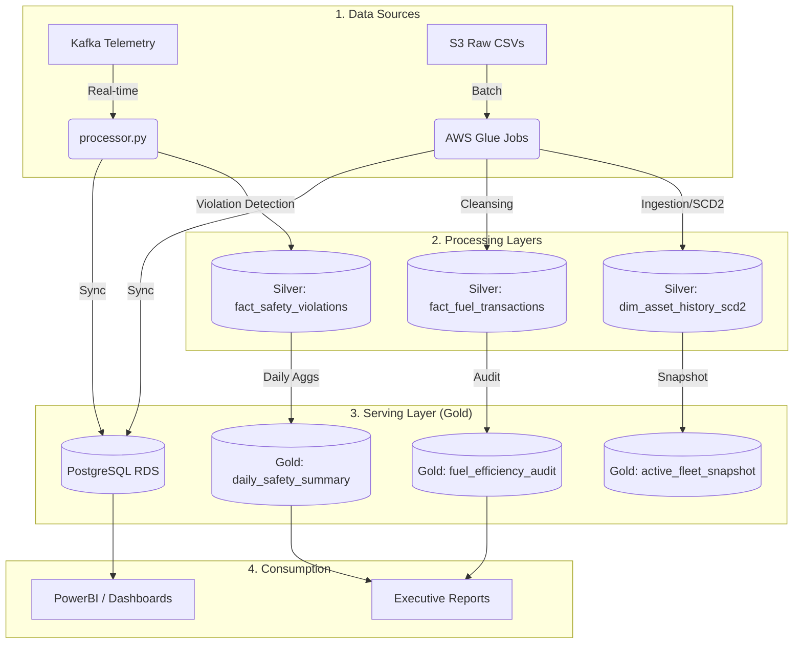

# Group2_POC_Bootcamp_Project
# 🌌 OmniRoute: Enterprise Logistics Data Platform

OmniRoute is a robust, production-grade logistics analytics platform designed to handle massive telemetry streams and batch organizational data. It implements a multi-layered Data Lake (Bronze-Silver-Gold) to provide real-time driver safety monitoring, fuel efficiency audits, and immutable fleet history.

---

## 🏗️ System Architecture

---

## 🚀 Tech Stack

- **Compute**: AWS Glue (Spark 3.3), EMR (Spark Streaming).
- **Storage**: AWS S3 (Delta Lake format for ACID transactions).
- **Messaging**: Apache Kafka (Self-hosted on EC2).
- **Database**: PostgreSQL (Serving layer with atomic Upsert logic).
- **Orchestration**: Apache Airflow (Fault-tolerant DAGs with S3 Sensors).
- **Logic**: PySpark, Python (psycopg2, boto3).

---

## 📂 Data Lake Layers

### 🥉 Bronze (Raw & Processed)
- **Raw**: Landed CSVs from vehicle registry, assignments, fuel, and maintenance.
- **Processed**: Initial "Data Firewall" pass. Trims whitespace, handles nulls, and validates basic schema integrity before partitioning by `ingestion_date`.

### 🥈 Silver (Cleaned & Curated)
- **`dim_asset_history_scd2`**: The heartbeat of the fleet. Implements Slowly Changing Dimensions (Type 2) to track which driver was in which vehicle at any specific second in history.
- **`fact_fuel_transactions`**: Deduped and enriched fuel receipts.
- **`dim_vehicle`**: Master vehicle registry with model and metadata.

### 🥇 Gold (Business Metrics)
- **`driver_safety_status`**: Monthly snapshot of driver performance. Tracks "Strikes" for Speeding and Geofence violations.
- **`fuel_efficiency_audit`**: Calculates KMPL (Kilometers Per Liter) by joining fuel logs with historical odometer readings.
- **`active_fleet_snapshot`**: Daily count of "In-Transit" vehicles grouped by model.

---

## 🛠️ The Batch Pipeline (Glue Jobs 1-8)

| Job | Name | Purpose |
| :--- | :--- | :--- |
| **Job 1** | `dim_core_load` | Loads vehicle registry and restricted zone geofences (JSON to Delta). |
| **Job 2** | `asset_scd2_engine` | The complex SCD2 engine. Handles incremental driver-to-vehicle assignments. |
| **Job 3** | `fuel_enrichment` | Cleanses raw fuel logs and performs deterministic deduplication. |
| **Job 4** | `fuel_audit` | Logic for fuel auditing and consumption analysis. |
| **Job 5** | `fleet_snapshot` | Generates a daily aggregation of the active fleet for management. |
| **Job 6** | `safety_summary` | Daily KPI generator (Total Violations, Top 10 Offenders). |
| **Job 7** | `maintenance_load` | Yearly ingestion of maintenance logs for predictive analysis. |
| **Job 8** | `monthly_cooldown` | **Monthly Rollover.** Resets strikes for safe drivers and generates PDF/TXT reports. |

---

## ⚡ Real-Time Streaming (`processor.py`)

The streaming engine consumes from Kafka and processes telemetry at 1-second intervals:
1. **Violation Detection**:
   - **Speeding**: Threshold-based checks.
   - **Geofence**: Spatial joins against `dim_restricted_zones` using high-precision `DoubleType` coordinates.
2. **Circuit Breaker**: If a driver is marked `SUSPENDED` in PostgreSQL, the streaming engine detects this mid-stream and ignores their telemetry until they are reinstated.
3. **Atomic Sync**: Uses the **Staging Table Pattern** in PostgreSQL to ensure that a failed Spark write never leaves the dashboard in a half-updated state.

---

## 🌬️ Orchestration & Fault Tolerance

Managed via **Airflow** with a focus on "Skip-on-Missing" logic:
- **S3KeySensors**: Wait for files for 1 hour. If they don't arrive, the sensor skips, and all dependent Glue jobs skip automatically.
- **Trigger Rules**: `none_failed_min_one_success` ensures that if Fuel data is missing, the Safety pipeline still executes correctly.

---

## ⚖️ Business Rules & Safety Logic

### 🚫 Safety Strikes
- **Speed Violation**: 1 Strike per detected event.
- **Geofence Violation**: 1 Strike per entry into a restricted zone.
- **Suspension**: Reaching **10 Strikes** automatically changes status to `SUSPENDED` and freezes the driver's `current_rate`.

### ❄️ Monthly Cooldown (Job 8)
Executed on the 1st of every month:
- **Active Drivers (< 10 strikes)**: Strikes reset to `0`. `current_rate` restored to `base_rate`.
- **Suspended Drivers (>= 10 strikes)**: No cooldown. Status and strikes are carried forward to the new month partition.
- **Immutable History**: Instead of updating rows, Job 8 creates a **New Partition**. This ensures we have a permanent record of every driver's performance for every month in history.

---

## ⚙️ Setup & Deployment

1. **Infrastructure**:
   - Create S3 buckets: `bronze`, `silver`, `gold`.
   - Setup EMR cluster with `delta-spark` and `postgresql` packages.
   - Provision PostgreSQL RDS with the schemas provided in `database/schema.sql`.

2. **Deployment**:
   - Upload all scripts in `glue_jobs/` to your Glue Script S3 path.
   - Deploy Airflow DAGs to your `dags/` folder.
   - Start the `processor.py` on EMR using `spark-submit --packages io.delta:delta-core_2.12:2.3.0,org.postgresql:postgresql:42.5.0`.

---

## 📊 Monitoring
- **Logs**: CloudWatch Logs for Glue Jobs.
- **Metrics**: Airflow UI for pipeline health.
- **Data Quality**: Check the `rejects/` prefix in S3 for rows that failed the Data Firewall checks.

---

> **OmniRoute** — *Safety First, Efficiency Always.* 🚛💨
